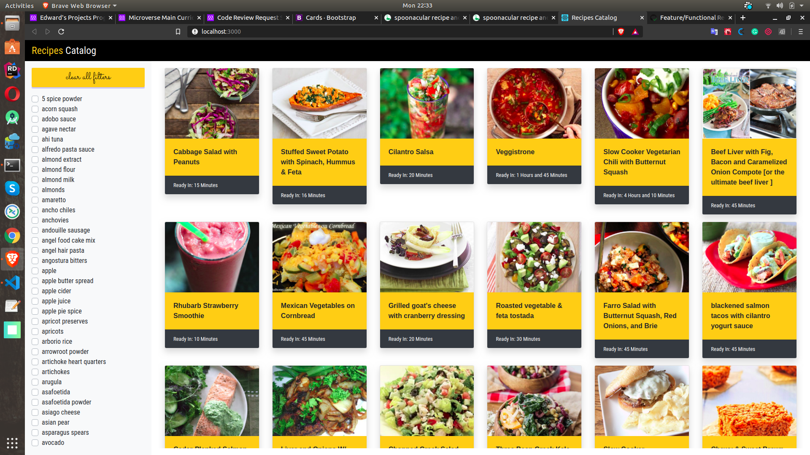
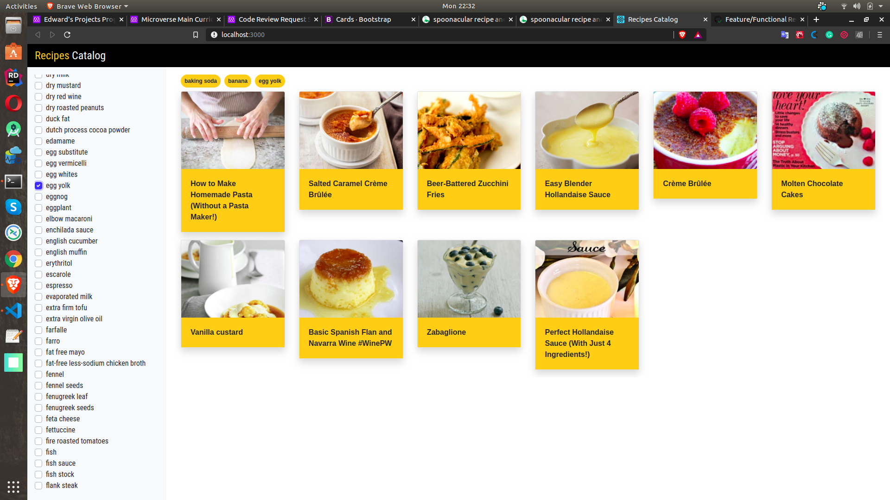

## Catalog of Recipes

### Introduction
The web application has 2 pages, `a  recipes list view` and `a recipe details view`. On the recipes list view we have listed several recipes, from which you can choose. Once you choose a recipe, its details are revealed on a new web page/view. 

The recipes listed can also be filtered by the ingredients.

We list as much information as we can about the recipe as we can, such as
  * Nutritional Information
  * Visualized Ingredients
  * e.t.c

### Sample Screenshots

#### All Recipes

#### Recipes Filtered By Ingredients (Baking Soda, Banana and Egg Yolk)

### Demos

For a live version of the application, please visit this [link](https://edward-recipes-catalog.herokuapp.com/) at heroku.

### Authors/Developers
  * [Edward Iga Kigongo](github.com/igakigongo)

### Versioning
We use SemVer for versioning. For the versions available, see the [tags](https://github.com/igakigongo/recipes-catalog/tags) and/or [releases](https://github.com/igakigongo/recipes-catalog/releases) sections of this repository.

### License

The project and all its source code are free for redistribution and modification.